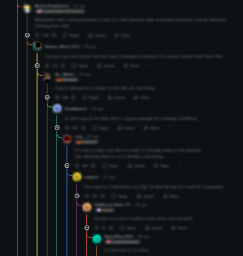

# Reddit Rainbow

Reddit Rainbow is a browser extension that improves the readability of Reddit by coloring nested comments with rainbow colors. It also highlights comments from the original poster (OP).

---

## Features

- Improve nested comments with rainbow colors for better readability.
- Highlighting of original poster (OP) comments.
- Customization of color intensity via a slider.

---

## Installation

1. Download the extension from your browser's extension catalog.
2. Enable the extension in your browser settings.
3. Go to Reddit and enjoy the rainbow!

---

## Privacy Policy

No personal data is collected, shared, or sent. All information remains on your device. See the [privacy policy](docs/privacy_policy.md) for more details.

---

## Upcoming Features

- Plugin compatibility with the old version of Reddit

---

## License

This project is royalty-free. See the [LICENSE.md](LICENSE.md) file for more information.
